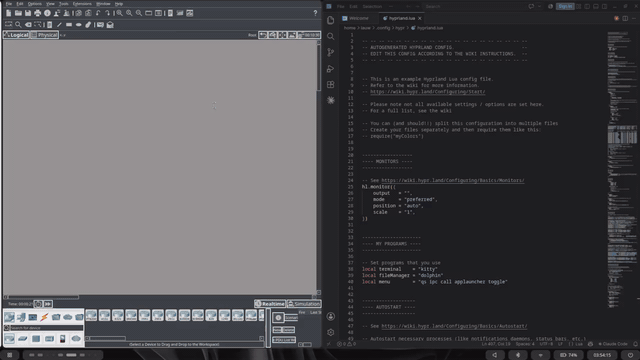
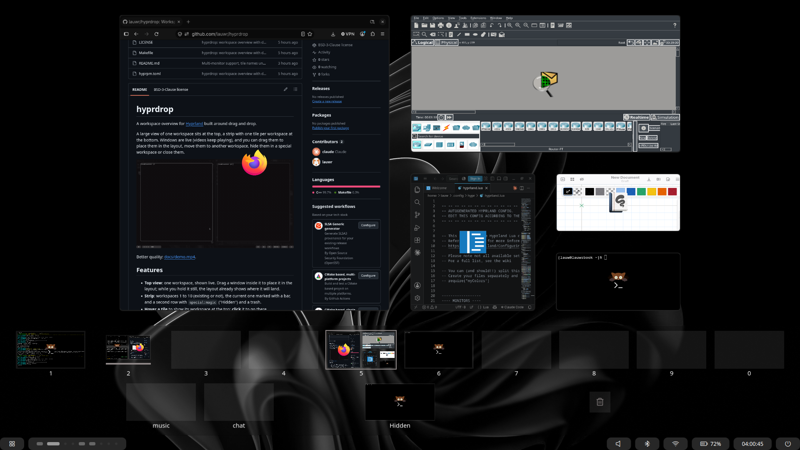

# hyprdrop

A workspace overview for [Hyprland](https://hypr.land) built around drag and drop.

A large view of one workspace sits at the top, a strip with one tile per workspace at the
bottom. Windows are live (videos keep playing), and you can drag them to place them in the
layout, move them to another workspace, hide them in a special workspace or close them.

[](docs/demo.mp4)

Better quality: [docs/demo.mp4](docs/demo.mp4).

## Features

- **Top view**: one workspace, shown live. Drag a window inside it to place it in the layout;
  while you hold it still, the layout already shows where it will land.
- **Strip**: workspaces 1 to 10 (existing or not), the current one marked with a bar, and a
  second row with `special:magic` ("Hidden") and a trash.
- **Hover a tile** to show its workspace at the top; **click** it to go there.
- **Drop a window on a tile** to move it there. Rest on the tile first to keep the overview
  open and follow it.
- **Trash**: drop a window on it to close it. Click it to toggle the delete mode, where a single
  click on a window closes it.
- **Drag mode**: bind `drag()` to Super + left button to drag a desktop window straight into
  the overview.
- Mouse, touchpad gestures, touchscreen, stylus and keyboard.
- Open / close and workspace-change animations; app icons on windows.



## Requirements

- Hyprland **0.56** with a Lua config (`hyprland.lua`). Developed and tested on **0.56.2**;
  other releases may need a fix (see [When a Hyprland update breaks the build](#when-a-hyprland-update-breaks-the-build)).
- To build: a C++23 compiler, `make`, `pkg-config` and Hyprland's headers (installed by
  `hyprpm update`, or with your distribution's Hyprland development package).

## Install

With hyprpm:

```sh
hyprpm add https://github.com/lauwr/hyprdrop
hyprpm enable hyprdrop
```

Or by hand:

```sh
make -j"$(nproc)"
hyprctl plugin load "$PWD/hyprdrop.so"
```

To load it at startup without hyprpm, add to `hyprland.lua`:

```lua
hl.plugin.load("/path/to/hyprdrop.so")
```

## Configuration

hyprdrop only does something when you call it. Example `hyprland.lua`:

```lua
local mainMod = "SUPER"

-- Open on the current workspace, or close
hl.bind(mainMod .. " + TAB", function() hl.plugin.hyprdrop.toggle_current() end)
-- Open on special:magic (on the current workspace if it is empty), or close
hl.bind(mainMod .. " + SHIFT + TAB", function() hl.plugin.hyprdrop.toggle_hidden() end)

-- Super + left button on a window: drag it into the overview
hl.bind(mainMod .. " + mouse:272", function() hl.plugin.hyprdrop.drag() end, { mouse = true })

-- Touchpad: 3 fingers up opens, up again opens special:magic; down closes / goes back
hl.gesture({ fingers = 3, direction = "up",   action = function() hl.plugin.hyprdrop.gesture_up() end })
hl.gesture({ fingers = 3, direction = "down", action = function() hl.plugin.hyprdrop.gesture_down() end })

-- Options (zqsd and debug default to false)
hl.config({
    plugin = {
        hyprdrop = {
            zqsd       = true,     -- the keys at the W A S D positions (Z Q S D on AZERTY) also navigate
            icon_theme = "breeze", -- icon theme for app icons; default: your desktop's (GTK, KDE, gsettings)
            debug      = true,     -- write a debug log to $XDG_RUNTIME_DIR/hyprdrop.log
        },
    },
})
```

| Lua function | Effect |
|---|---|
| `toggle_hidden()` | Opens with `special:magic` at the top (the current workspace if it is empty), or closes. |
| `toggle_current()` | Opens with the current workspace at the top, or closes. |
| `drag()` | Opens with the window under the cursor already dragged (bind it to a mouse button). |
| `gesture_up()` / `gesture_down()` | For touchpad gestures, see above. |

Colors follow your config: `general:col.active_border`, `decoration:rounding`, `general:gaps_in`.
App icons come from your icon theme (and the themes it inherits), then `hicolor`, then
`/usr/share/pixmaps`.

## Usage

| Action | Effect |
|---|---|
| Hover a tile | Shows its workspace at the top |
| Click a tile | Goes to that workspace |
| Click a window (current workspace) | Goes to it |
| Click a window (other workspace) | Brings it to the current workspace |
| Double click a window | Goes to it |
| Drag a window in the top view | Places it there |
| Drag a window to a tile | Moves it to that workspace (rest on the tile to stay open) |
| Drag a window to the trash | Closes it |
| Click the trash | Toggles the delete mode (a click on a window closes it) |
| Click the background, Escape, the key bind that opened it | Closes the overview |
| Enter, Space | Goes to the workspace shown at the top |
| Arrows, keypad 4 6 8 2 | Changes the workspace shown at the top |
| 3-finger horizontal swipe | Changes the workspace shown at the top |

On a touchscreen or with a stylus, a tap on a tile shows it and a second tap goes there.

### Drag and drop

Press a window in the top view and move it a few pixels: the drag starts. A ghost of the
window (half size, translucent, with its icon) follows the pointer. A press that doesn't
move stays a click.

Where you release it:

| Released on | Effect | Overview |
|---|---|---|
| The top view | The window is placed there in the layout | Stays open |
| A tile, after resting on it | Moved to that workspace | Stays open, showing that workspace |
| A tile, without resting | Moved to that workspace | Closes |
| The trash | The window is asked to close (it may still ask to save) | Stays open |
| Anywhere else | Cancelled: the window goes back where it was | Stays open |

While you drag:

- **Resting in the top view** (about 70 ms) already places the window: the layout shows
  where it will land, and moves again each time you rest somewhere else.
- **Resting on a tile** (half a second) shows that workspace at the top, so you can place the
  window precisely in it. The tile under a drag gets a white border; the trash turns red.

**Drag mode** (`drag()`, e.g. Super + left button on a desktop window) opens the overview
on the current workspace with that window already held. It works the same, except that:

- released in the top view on the current workspace, the window is placed and the overview
  closes, like Hyprland's own window drag;
- released on the trash, the window is asked to close and the overview closes;
- released anywhere else than a tile, the top view or the trash, the drag is cancelled and
  the overview closes.

### Touchpad gestures

With `gesture_up()` / `gesture_down()` bound to 3-finger swipes (see Configuration):

| State | Up | Down |
|---|---|---|
| Nothing open | Opens the overview | Nothing |
| Overview open | Closes it and opens `special:magic` | Closes it |
| `special:magic` open (however it was opened) | Closes it, opens the overview on the workspace under it | Closes it |

A horizontal swipe while the overview is open changes the workspace shown at the top
without going there.

## Limitations

- Several monitors: the overview opens on the focused monitor only. Workspaces living on
  other monitors are shown in it (their tile names the monitor) and windows can be sent to
  them, but there is no overview on the other monitors at the same time.
- The special workspace is `special:magic`; other special workspaces are not shown.
- It uses Hyprland internals, so each Hyprland release may need a rebuild or a fix.

## Development

### Code layout

| File | Role |
|---|---|
| `src/hyprdrop.hpp` | Shared state, types and declarations. Starts with the vocabulary used everywhere (top view, strip, D, A). |
| `src/main.cpp` | Plugin entry and exit, Lua functions, event hooks, per-frame live capture. |
| `src/capture.cpp` | Renders each window and the wallpaper into textures; finds workspaces. |
| `src/layout.cpp` | Where everything goes on screen (one function for drawing and hit-testing), animation progress. |
| `src/overview.cpp` | What clicks and drops do: drag, place, move to a workspace, close, go to. |
| `src/input.cpp` | Mouse, touchscreen, stylus, keyboard, touchpad gestures, scroll. |
| `src/render.cpp` | Drawing: views, tiles, labels, icons, borders, trash, ghost. |

Each `.cpp` keeps its own state `static`; only what several files use is in the header.

### Build, reload, debug

```sh
make -j"$(nproc)"
# Reloading the same path may keep the old code in memory: load a fresh copy.
cp hyprdrop.so /tmp/hyprdrop-$(date +%s).so
hyprctl plugin unload <path of the loaded copy>   # unload first: it removes hl.plugin.hyprdrop
hyprctl plugin load /tmp/hyprdrop-<timestamp>.so
```

Turn the log on without editing the config, then read it:

```sh
hyprctl eval 'hl.config({ plugin = { hyprdrop = { debug = true } } })'
tail -f "$XDG_RUNTIME_DIR/hyprdrop.log"
```

Every action is logged (press, drag, placement, capture, workspace change), and each close
logs the frame rate of the session. Per-frame captures are not logged.

### When a Hyprland update breaks the build

hyprdrop uses Hyprland internals, which can be renamed or changed between releases. They are
reached with `#define protected public` / `#define private public` in `hyprdrop.hpp`. What it
relies on, by file:

- `capture.cpp`: `beginRender` / `endRender` with `RENDER_MODE_FULL_FAKE`, `renderWindow`,
  `renderLayer`, `m_renderData.blockScreenShader`, `createFB`; swapping
  `m_activeWorkspace` / `m_activeSpecialWorkspace` / `m_visible` with
  `Animation::Workspace::startAnimation` to render hidden workspaces; `CWindow::m_suspended` /
  `setSuspended` and the surface `frame()` callbacks to keep hidden windows drawing;
  `m_reservedArea`, `m_layerSurfaceLayers`, `getWorkspaceRuleFor`.
- `overview.cpp`: `g_layoutManager->beginDragTarget` / `moveMouse` / `endDragTarget` (the
  native drag replayed to place a tiled window, with the cursor moved by
  `pointerController()->warpTo` meanwhile), `setTargetGeom`,
  `State::workspaceState()->create`, `Config::Actions::*` (`moveToWorkspace`,
  `changeWorkspace`, `toggleSpecial`, `focus`, `closeWindow`).
- `render.cpp`: `m_renderPass` with `CRectPassElement`, `CTexPassElement`,
  `CBorderPassElement`; `renderText`, `createTexture`; config values
  `general:col.active_border`, `decoration:rounding`, `misc:font_family`.
- `main.cpp`: `Event::bus()` events, `updateSuspendedStates` (gives the suspended state back
  on close), `addConfigValueV2`, `addLuaFunction`.
- `input.cpp`: `Pointer::Cursor::overrideController` (cursor shape while open).

A build error usually names the member that moved: look for it in the matching Hyprland
release's headers (`/usr/include/hyprland/src`) and in hyprexpo, which uses the same kind of
internals.

## Credits

- Built with [Claude Code](https://claude.com/claude-code): lauwr designed the behavior and
  tested every step; the code was written with Claude Code.
- Trash icon: [Phosphor Icons](https://phosphoricons.com) (MIT license).
- Inspired by [Hyprspace](https://github.com/KZDKM/Hyprspace) and
  [hyprexpo](https://github.com/hyprwm/hyprland-plugins).

## License

BSD 3-Clause, see [LICENSE](LICENSE).
